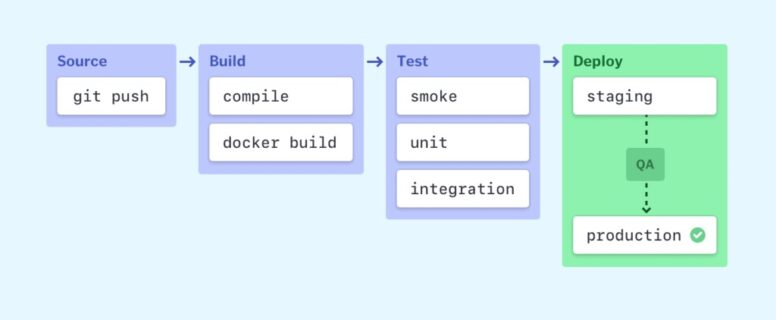

# 3 CI/CD

> **TL;DR:** A CI/CD pipeline is not just a convenience — it is a quality control system. Automate early, keep feedback fast, isolate environments, and build in rollback from the start. The goal is to make deploying software boring: predictable, low-risk, and repeatable.

---

## Introduction

When a startup grows, the team needs a CI/CD process that is both fast and reliable. For our context, the challenge is to release more often without increasing production risk. The five selected sources show the same pattern: manual delivery slows teams down, while automation improves quality, speed, and confidence.

Developers need quick delivery but the organization also needs stable releases. Without a structured pipeline, teams can spend too much time on manual steps such as rework on the code base and late bug detection.

In order to fix this issue, the team should define a CI/CD baseline that fits the current engineering context and can scale with future projects.

---

## Base Pipeline

The base pipeline should cover the minimum quality gates expected in modern CI/CD like automated build, automated tests, and controlled deployment steps. This baseline should run on every relevant change to keep feedback fast and consistent.

As highlighted across the sources, a strong foundation includes:

- Full automation for build, test & deployment tasks.
- Version controlled code and configuration, with traceable release tags.
- Caching to reduce waiting time for heavy processes.

The team should also keep the pipeline simple at first, then extend it progressively. A practical sequence is: `build + test` first, then add deployment, notifications, security scanning, and advanced release strategies.

The diagram below illustrates how a typical pipeline progresses from a developer's commit to a production deployment, with each stage acting as a quality gate before the next begins.

*Source: Semaphore — [CI/CD Pipeline: A Gentle Introduction](https://semaphore.io/blog/cicd-pipeline)*

---

## Delivery Safeguards

To keep releases safe while moving quickly, the pipeline should include:

- Branch protection and release tagging on critical branches — reduces accidental changes and improves traceability.
- Strict environment separation — staging and production must remain isolated; validate in staging before rolling out to production.
- Rollback and fail-fast behavior — if checks fail, the release stops immediately, the team is notified, and a fast rollback path is available.
- Multi-stage Docker builds to reduce image size and attack surface.
- Flexible trigger rules so heavy pipelines run only when relevant files, branches, or events are involved.
- Security checks (SAST, dependency scans, secret handling) integrated directly into CI.

---

## Team Enablement Package

After defining the baseline and safeguards, the team should provide operational support that makes CI/CD sustainable in daily work.

This may include:

- Clear pipeline documentation for onboarding and troubleshooting.
- Team notifications (Slack/email/status checks) for immediate failure visibility.
- Shared templates for repositories to standardize CI/CD across projects.
- Collaboration habits: pipeline health is team-owned, not only DevOps-owned.

For mobile workflows specifically, the same principle applies with mobile tooling: build/test automation, staged distribution (for example internal testers before store release), protected secrets for signing keys, and optimized build times.

---

## At a Glance

| Good practice | Anti-pattern |
|---|---|
| Merge small changes to main daily | Work on long-lived feature branches for weeks |
| Keep pipelines simple enough for anyone to fix | Build elaborate pipelines only the author understands |
| Run cheap checks first, parallelise the rest | Run all checks sequentially regardless of cost |
| Keep build times under 10 minutes | Accept 30-minute pipelines and wonder why no one waits |
| Store pipeline config in version control | Maintain pipelines through a UI with no audit trail |
| Isolate staging from production completely | Share databases or credentials between environments |
| Design rollback before you need it | Rely on hotfixes and manual recovery after incidents |
| Integrate security scanning in every build | Add a security scan once, update it never |
| Alert the team immediately on pipeline failure | Check pipeline status manually at end of day |

> **Common failure mode:** the pipeline passes, so the team assumes the code is correct. A green pipeline means the code passed the tests that were written — it does not mean the code is correct. Build confidence incrementally: more test coverage, better integration tests, and post-deployment monitoring that catches what unit tests cannot.

---

## Common Themes Across Sources

- **Speed and safety are not a trade-off.** Automated checks are faster than manual ones. Konda measured deployment time dropping from 2 hours to under 10 minutes after building a proper pipeline [(Konda)](#sources).
- **Simplicity is a feature.** Mishra found that over-engineered pipelines become unmaintainable — a pipeline everyone can debug is more valuable than a sophisticated one only the author understands [(Mishra)](#sources).
- **Culture matters as much as tooling.** The biggest barrier to good CI/CD is teams that blame individuals for failures rather than improving the system. A pipeline is only as good as the team's commitment to keeping it green.

---

## Sources

1. Nixys, *From 2024 to 2025: Reflecting on CI/CD best practices*  
   https://medium.com/@nixys_io/from-2024-to-2025-reflecting-on-ci-cd-best-practices-030efa6d58d9
2. Dhruvin Soni, *CI/CD Best Practices*  
   https://medium.com/@dksoni4530/ci-cd-best-practices-c288f6846346
3. David Onuche, *Best Practices for CI/CD Pipelines in Mobile Apps*  
   https://medium.com/@davidonuche/best-practices-for-ci-cd-pipelines-in-mobile-apps-8ea88df8580e
4. Bhuwan Mishra, *CI/CD Best Practices: Lessons Learned from Real-World Projects*  
   https://medium.com/@bhuwanmishra_59371/ci-cd-best-practices-lessons-learned-from-real-world-projects-6b51add94d73
5. Laxmi Pratyusha Konda, *CI/CD Pipelines: Lessons from a Decade of Deployments*  
   https://medium.com/@reachpratyu.k/ci-cd-pipelines-lessons-from-a-decade-of-deployments-233e6d6547cd
