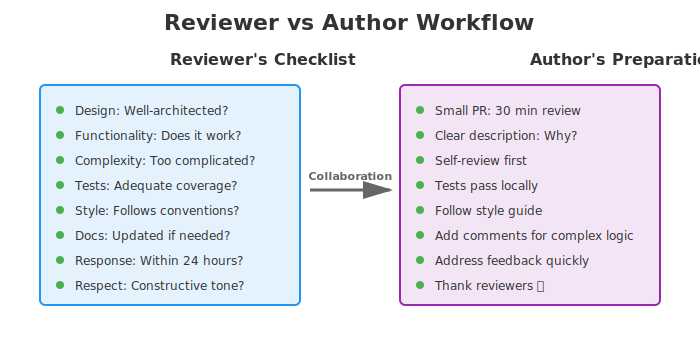

# How to Give and Receive Effective Code Reviews

## Purpose

Code reviews are a critical part of our development process. They help us maintain code quality, share knowledge across the team, and catch bugs before they reach production. This guide provides practical advice for both reviewers and authors to make code reviews effective and constructive.

## Table of Contents

1. [For Reviewers](#for-reviewers)
2. [For Authors](#for-authors)
3. [Code Review Standards](#code-review-standards)
4. [Best Practices](#best-practices)
5. [Common Mistakes to Avoid](#common-mistakes-to-avoid)
6. [References](#references)

---

## Process Overview

The code review process follows our trunk-based development model. Every change goes through review before merging to main.

---

## For Reviewers

### Your Role as a Reviewer

As a reviewer, your job is to ensure that code being merged meets our quality standards while being respectful and constructive toward the author.

### What to Look For

When reviewing code, evaluate the following aspects:

- **Design**: Is the code well-designed and appropriate for our system? Does it follow established patterns?
- **Functionality**: Does the code do what the author intended? Will it work correctly for its users?
- **Complexity**: Could the code be simpler? Will another developer understand it easily in the future?
- **Tests**: Are there adequate automated tests? Are they well-designed and comprehensive?
- **Naming**: Are variable, class, and function names clear and descriptive?
- **Comments**: Are comments clear, helpful, and non-obvious?
- **Style**: Does the code follow our style guides and conventions?
- **Documentation**: Has the developer updated relevant documentation?

### Picking the Best Reviewer

- The best reviewers are those most familiar with the code being changed
- Assign reviews to CODEOWNERS when possible
- For complex changes, consider having multiple reviewers
- If the ideal reviewer is unavailable, request them as a secondary reviewer

### Review Etiquette

- **Be respectful and constructive**: Review the code, not the person
- **Ask questions**: Use questions to help the author think through their solution
- **Acknowledge good work**: Compliment clever solutions and good practices
- **Respond in a timely manner**: Review PRs within 24 hours when possible
- **Be specific**: Point to exact lines and explain why changes are needed
- **Prioritize critical issues**: Flag blocking issues vs. optional improvements
- **Assume good intent**: The author is trying to improve the codebase

### Levels of Feedback

- **MUST FIX**: Critical issues that must be resolved before merge (bugs, security issues, architectural problems)
- **SHOULD FIX**: Important improvements that would benefit the code (performance, readability, maintainability)
- **NICE TO HAVE**: Suggestions for future improvements or learning opportunities
- **APPROVED**: No blocking issues; code is ready to merge

---

## For Authors

### Preparing Your Code for Review

- **Keep PRs small**: Aim for PRs that can be reviewed in under 30 minutes
- **Write a clear description**: Explain what changed and why
- **Test thoroughly**: Ensure your code passes tests before requesting review
- **Self-review first**: Review your own code before submitting for review
- **Follow the style guide**: Consistency makes reviews faster
- **Add comments for complex logic**: Help reviewers understand non-obvious decisions

### Responding to Feedback

- **Don't take it personally**: Feedback is about the code, not you
- **Ask for clarification**: If feedback is unclear, ask questions
- **Explain your reasoning**: If you disagree, explain why in a respectful way
- **Fix issues promptly**: Address feedback quickly to keep momentum
- **Resolve conversations**: Mark conversations as resolved only after addressing feedback
- **Thank reviewers**: Acknowledge the time they spent on your code

### Requesting Review from Specific People

- Tag reviewers explicitly when requesting review
- Mention @mentions for people you'd specifically like to review parts of your code
- Provide context if this is a follow-up to a previous discussion

---

## Code Review Standards

### Definition of Done

Code is ready to merge only when:

1. ✓ All automated tests pass
2. ✓ At least one teammate has approved the PR
3. ✓ All feedback has been addressed
4. ✓ Code follows our style guide
5. ✓ Documentation is updated if needed

### Review Turnaround Time

- **First review**: Within 24 hours of PR submission
- **Follow-up reviews**: Within 12 hours of author response to feedback
- **Blocking reviews**: Address urgent PRs immediately

### Handling Disagreements

- Focus on facts, not opinions
- Reference our style guide or architecture decisions
- If stuck, bring in a third party or tech lead
- Default to the author's preference if the issue is subjective and not harmful

---

## Best Practices

### For Both Reviewers and Authors

1. **Keep communication respectful and collaborative**: We're all working toward the same goal
2. **Use emoji reactions**: 👍 to show agreement without adding a comment
3. **Know when to have a synchronous discussion**: Some disagreements are better resolved verbally
4. **Document decisions**: If a standard is unclear, update the handbook
5. **Give specific, actionable feedback**: "Improve this function" is less helpful than "Extract this loop into a helper function"
6. **Celebrate learning moments**: Code reviews help the whole team improve

### Review and Author Workflow

### Code Review Checklist

**For Reviewers:**
- [ ] Code is understandable and maintainable
- [ ] Tests exist and are comprehensive
- [ ] No obvious bugs or logical errors
- [ ] Performance is acceptable
- [ ] Security considerations are addressed
- [ ] Code follows our conventions
- [ ] Documentation is up to date

**For Authors:**
- [ ] PR description is clear and complete
- [ ] All tests pass locally and in CI
- [ ] Code follows the style guide
- [ ] No unnecessary changes included
- [ ] Commit messages are clear
- [ ] Related documentation is updated

---

## Common Mistakes to Avoid

### Reviewers Should Avoid

- **Being dismissive**: Avoid comments like "this is wrong" without explanation
- **Bikeshedding**: Don't focus heavily on minor style preferences over substance
- **Blocking on preferences**: Use "SHOULD" language for optional improvements
- **Long feedback sessions**: If feedback is extensive, suggest a call
- **Reviewing while tired**: Your review quality matters

### Authors Should Avoid

- **Responding defensively**: Take feedback as help, not criticism
- **Submitting large PRs**: Make reviewers' job harder
- **Ignoring feedback**: Even if you disagree, engage with the reviewer
- **Force-pushing without explanation**: Communicate changes to your reviewers
- **Merging with unresolved comments**: Address all feedback before merging

---

## References

1. **Google Engineering Practices**: Code Review
   - https://google.github.io/eng-practices/review/
   - Overview and standards for code review processes

2. **Google's "How To Do A Code Review"**
   - https://google.github.io/eng-practices/review/reviewer/
   - Detailed guide for code reviewers

3. **Google's "The CL Author's Guide"**
   - https://google.github.io/eng-practices/review/developer/
   - Guide for developers receiving code reviews

4. **SmartBear Code Review Best Practices**
   - https://smartbear.com/blog/code-review-best-practices/
   - Industry insights on effective code review practices

5. **Atlassian Code Review Best Practices**
   - https://www.atlassian.com/blog/bitbucket/best-practices-for-code-reviews
   - Practical tips for team code reviews

---

