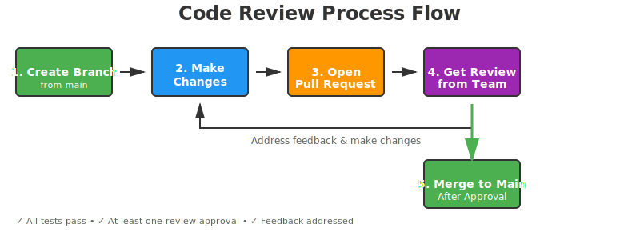
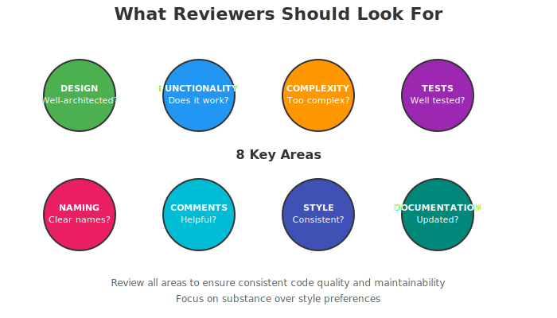
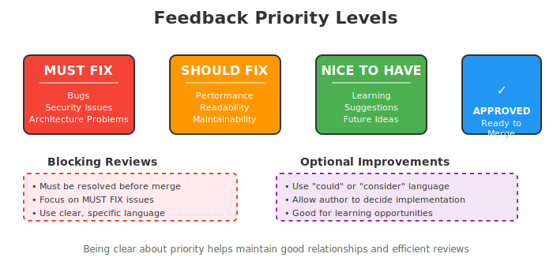

# How to Give and Receive Effective Code Reviews

> **TL;DR:** Code reviews improve quality and prevent knowledge silos, but only when done well. Be constructive, not critical. Focus feedback on substance, not preference. Keep reviews fast (24-48 hours). The goal is to help the author improve, not to prove you're smarter.

## Purpose

Code reviews are a critical part of our development process. They help us maintain code quality, share knowledge across the team, and catch bugs before they reach production. This guide provides practical advice for both reviewers and authors to make code reviews effective and constructive.

## Table of Contents

1. [For Reviewers](#for-reviewers)
2. [For Authors](#for-authors)
3. [Best Practices & Common Mistakes](#best-practices--common-mistakes)
4. [Common Themes](#common-themes-across-sources)
5. [References](#references)

---

## Process Overview

The code review process follows our trunk-based development model. Every change goes through review before merging to main.

---

## For Reviewers

### Your Role as a Reviewer

As a reviewer, your job is to ensure that code being merged meets our quality standards while being respectful and constructive toward the author.

### What to Look For

When reviewing code, evaluate the following aspects:

- **Design**: Is the code well-designed and appropriate for our system? Does it follow established patterns?
- **Functionality**: Does the code do what the author intended? Will it work correctly for its users?
- **Complexity**: Could the code be simpler? Will another developer understand it easily in the future?
- **Tests**: Are there adequate automated tests? Are they well-designed and comprehensive?
- **Naming**: Are variable, class, and function names clear and descriptive?
- **Comments**: Are comments clear, helpful, and non-obvious?
- **Style**: Does the code follow our style guides and conventions?
- **Documentation**: Has the developer updated relevant documentation?

### Picking the Best Reviewer

- The best reviewers are those most familiar with the code being changed
- Assign reviews to CODEOWNERS when possible
- For complex changes, consider having multiple reviewers
- If the ideal reviewer is unavailable, request them as a secondary reviewer

### Review Etiquette

- **Be respectful and constructive**: Review code, not character. Assume good intent.
- **Be specific**: Point to exact lines and explain the why, not just "this is wrong"
- **Use the right tone**: "Could this be simpler?" is better than "This is bad"
- **Acknowledge good work**: Highlight clever solutions and good practices
- **Respond in 24 hours**: Fast feedback beats perfect feedback
- **Prioritize critical issues**: Flag blocking vs. optional improvements

### Levels of Feedback

- **MUST FIX**: Critical issues that must be resolved before merge (bugs, security issues, architectural problems)
- **SHOULD FIX**: Important improvements that would benefit the code (performance, readability, maintainability)
- **NICE TO HAVE**: Suggestions for future improvements or learning opportunities
- **APPROVED**: No blocking issues; code is ready to merge

---

## For Authors

### Preparing Your Code for Review

- **Keep PRs small**: Aim for PRs that can be reviewed in under 30 minutes
- **Write a clear description**: Explain what changed and why
- **Test thoroughly**: Ensure your code passes tests before requesting review
- **Self-review first**: Review your own code before submitting for review
- **Follow the style guide**: Consistency makes reviews faster
- **Add comments for complex logic**: Help reviewers understand non-obvious decisions

### Responding to Feedback

- **Don't take it personally**: Feedback is about the code, not you
- **Ask for clarification**: If feedback is unclear, ask questions
- **Explain your reasoning**: If you disagree, explain why in a respectful way
- **Fix issues promptly**: Address feedback quickly to keep momentum
- **Resolve conversations**: Mark conversations as resolved only after addressing feedback
- **Thank reviewers**: Acknowledge the time they spent on your code

### Requesting Review & Handling Disagreements

- Tag reviewers explicitly when requesting review
- Provide context if this is a follow-up to a previous discussion
- Focus on facts, not opinions
- Reference your style guide or architecture decisions when disagreeing
- If stuck, bring in a third party or tech lead
- Default to the author's preference if the issue is subjective and not harmful

---

## Best Practices & Common Mistakes

### Reviewers: What to Avoid

- Being dismissive without explanation
- Focusing heavily on minor style preferences
- Blocking on subjective preferences (use "SHOULD" language for optional feedback)
- Reviewing when tired—your quality matters

### Authors: What to Avoid

- Submitting large, hard-to-review PRs
- Responding defensively to feedback
- Ignoring feedback even if you disagree
- Merging with unresolved comments

---

## Common Themes Across Sources

After reviewing practitioner experiences and industry research, several patterns emerge consistently:

- **Code reviews prevent knowledge silos but fail when tone is wrong.** The most common failure is not reviewing too little or too much, but reviewing in a way that feels personal rather than professional. When feedback feels like criticism of the person instead of the code, developers become defensive and stop listening.
- **Speed matters more than perfection.** Multiple practitioners report that a review completed in 24 hours and merged quickly teaches more than a perfect review delivered a week later. Context switches and waiting kill momentum and the learning opportunity.
- **Specific feedback beats vague feedback every time.** "This function is too complex" creates defensiveness. "This function would be easier to test if we extracted the validation logic" creates agreement and actual improvement.
- **The hardest part is cultural, not technical.** Teams that struggle with code reviews rarely lack process—they lack psychological safety. Engineers pad estimates to avoid code review delays. Reviewers soften feedback to avoid conflict. The tooling and templates matter far less than whether people feel safe being honest.
- **Consistency in standards prevents endless debates.** Teams that reference a shared style guide, architecture document, or past decisions spend far less time arguing about subjective preferences and far more time catching actual bugs.

---

## References

1. [Code Review: Do's and Don'ts for Developers and Reviewers](https://www.michaelagreiler.com/code-review-best-practices-and-when-to-avoid-code-reviews/) by Michaela Greiler
   - Personal experience from leading code review culture changes at large tech companies

2. [Code Review in the Era of Continuous Integration](https://engineeringblog.yelp.com/2017/11/code-review-in-the-era-of-continuous-integration.html) by Yelp Engineering
   - Practitioner insights from scaling code reviews at a fast-growing company

3. [OWASP Code Review Guide](https://www.owasp.org/index.php/Code_Review_Guide) by OWASP Foundation
   - Evidence-based guide on code review effectiveness and psychological safety

4. [Peer Code Review: Lessons Learned at Scale](https://engineering.meta.com/) by Meta Engineering
   - Real experiences scaling code review practices across thousands of engineers

5. [The Morning Paper: Code Review Research](https://www.adriancolyer.org/) by Adrian Colyer
   - Synthesis of peer-reviewed research on code review effectiveness and impact
