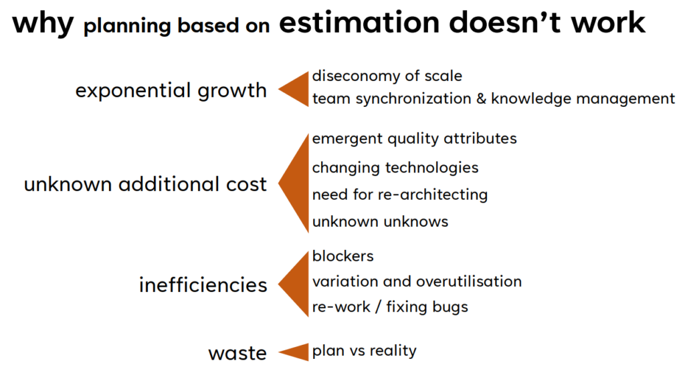
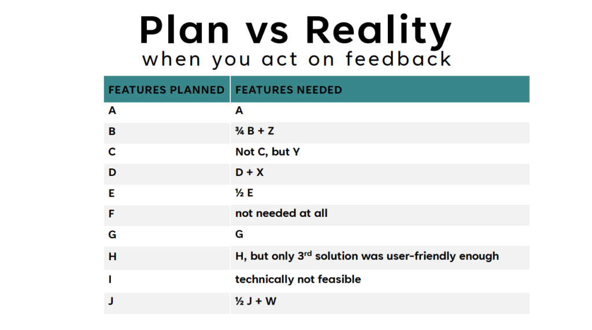

# Task Estimation in Scrum

> **TL;DR:** Estimates are always uncertain. Use them as a tool for planning and discussion, not as deadlines or performance targets. The goal is to improve over time, not to be perfect from the start.

---

## Why Estimation Matters

Poor estimates are one of the most common reasons projects fail. A team might start a sprint confidently, then discover midway through that a single task takes as long as the entire sprint was planned for. This has happened in real projects: in one case involving AI-driven NPCs for a video game, the AI component was left too late. By the deadline, the NPCs barely worked. The task had been underestimated, work started late, and there was no time to recover.

In a startup with 20 engineers, this kind of delay can lead to missed releases, rushed features, and bugs reaching production. Scrum uses estimation to help teams plan sprints, communicate with stakeholders, and learn from past work. However, when done poorly, estimation creates false confidence and pressure that actually makes outcomes *worse*.

---

## How to Think About Estimation: Hours vs. Story Points

In practice, teams that estimate in hours quickly find that those hours become deadlines. A developer says "two days", and two weeks later a manager is asking why it took four. Story points were meant to avoid this — but they create their own problems. Without a shared reference for what a "5" actually means on your team, the scale drifts over time and people end up speaking different languages in the same planning session.

The pattern that tends to work is estimating in **relative complexity** while sanity-checking against rough hours. If no one can explain why a task would take longer than a similar one, the estimate is not grounded in anything real.

---

## Why Estimates Go Wrong

Estimation fails for many reasons, but most of them follow a pattern: teams underestimate early, then face pressure when reality turns out to be harder than expected. The diagram below summarises the most common structural reasons behind this.

*Source: Urs Enzler, Planet Geek (2024) — [(Mis)estimation – why estimates tend to be wrong](https://www.planetgeek.ch/2024/02/07/misestimation-why-estimation-does-not-work/)*

A particularly clear illustration of the gap between plans and reality is the following diagram, which shows how what teams plan at the start rarely matches what actually gets delivered.

*Source: Urs Enzler, Planet Geek (2024) — [(Mis)estimation – why estimates tend to be wrong](https://www.planetgeek.ch/2024/02/07/misestimation-why-estimation-does-not-work/)*

**Common causes:**

- **Optimism bias:** developers estimate the happy path — no blockers, no unclear requirements, no integration surprises. Daigle (DEPT Agency) describes this as one of the most persistent problems in engineering teams: complications always appear, and they always take time [(Daigle, DEPT Agency)](https://engineering.deptagency.com/why-software-development-estimates-are-so-often-wrong).
- **Estimating too early:** estimates are locked in at the start of a project, when the team knows the *least* about the work. Initial estimates can easily end up 2–4 times too low.
- **Hidden complexity compounds:** Enzler found that 100 tasks, each with only 1–2% extra integration work, can add 70–200 unplanned days to a project — a number no one would have predicted at the start [(Enzler, Planet Geek)](https://www.planetgeek.ch/2024/02/07/misestimation-why-estimation-does-not-work/).
- **Anchoring bias:** whoever speaks first sets an invisible ceiling. Other team members adjust toward that number rather than thinking independently — a pattern Agile Seekers found repeated across teams regardless of experience level [(Agile Seekers)](https://agileseekers.com/blog/cognitive-biases-that-ruin-sprint-planning-and-how-to-avoid-them).
- **Velocity used as a performance metric:** when teams are measured by velocity, they inflate estimates to look more productive. Walsh at Axify describes this as the point where the data becomes completely unreliable [(Walsh, Axify)](https://axify.io/blog/story-points).

---

## The Estimation Process in Practice

Teams often know what good estimation looks like in theory, but the process breaks down in predictable ways. Stakeholders push for faster answers, estimates get locked in before the work is understood, and no one revisits them when reality changes. The result is a sprint plan that is outdated before it even starts.

Story points are meant to measure relative complexity, but in practice they frequently get misused. The infographic below shows the most common ways this happens in real teams.

*Source: Alexandre Walsh, Axify — [Why Story Points Don't Matter and What to Use Instead](https://axify.io/blog/story-points)*

---

## Good Practices to Follow

- **Estimate as a team, at the same time.** When one person dominates or estimates alone, the result reflects one opinion, not the team's collective understanding. Disagreement between team members is often where the most valuable discussion happens.
- **Use reference stories.** Green (Humanizing Work) found that without concrete examples anchoring the scale, point values drift and lose meaning — teams end up comparing tasks to nothing [(Green, Humanizing Work)](https://www.humanizingwork.com/how-to-fix-story-point-estimation/).
- **Break down anything that feels uncertain.** If a task cannot be estimated with confidence, it is too big or too vague. Splitting it forces the team to confront assumptions early rather than mid-sprint.
- **Check estimates against rough hours.** Even when using story points, ask: "does this feel like half a day or three days?" Vague estimates that cannot be loosely mapped to time are usually not grounded in reality.
- **Update estimates when you learn something new.** An estimate reflects what the team knew at one point in time. When that changes, the estimate should too — silently hoping to catch up is how sprints collapse.
- **Run a quick pre-mortem.** Before committing to a sprint, ask: "if this goes wrong, what is the most likely reason?" It surfaces hidden risks before they become emergencies.
- **Review actual results in retrospectives.** If estimates are consistently wrong in the same direction, that is a process problem, not bad luck. The only way to improve is to look at the data honestly.

---

## At a Glance

| Good practice | Anti-pattern |
|---|---|
| Estimate together as a team | One person estimates for everyone |
| Use relative sizing with reference examples | Invent a scale with no shared anchor |
| Discuss disagreements instead of averaging | Average outliers away to move faster |
| Break stories down before estimating | Accept vague, unrefined tasks into planning |
| Track velocity over multiple sprints | Start from scratch each sprint |
| Treat estimates as forecasts | Treat estimates as deadlines or commitments |
| Revise estimates when scope changes | Hold people to estimates after requirements change |

> **Common failure mode:** management treats estimates as promises. This causes engineers to pad numbers defensively, which then get treated as even bigger promises. Be transparent with stakeholders: estimates are forecasts, not contracts.

---

## Common Themes Across Sources

After reviewing the five references, several themes came up consistently — not as theory, but as things practitioners had experienced and struggled with:

- **Estimates always become deadlines, unless you actively prevent it.** Every source describes the same pattern: a rough estimate gets repeated up the chain and arrives at the client as a commitment. Engineers then feel accountable for a number that was never meant to be precise.
- **The psychological pressures are harder to fix than the process.** Optimism, anchoring, and fear of looking slow distort estimates even in teams with good intentions and solid methodology. Multiple sources point out that awareness alone is not enough — the environment has to make honest estimation safe.
- **Story points solve one problem and create another.** They remove the false precision of hours, but invite gaming when velocity becomes a target. Several authors argue the metric is only useful when the team genuinely does not care about the number itself.
- **Individual estimation is almost always worse.** When one person — especially someone senior — gives a number first, the rest of the team rarely challenges it. The estimate reflects authority, not reality.
- **Looking back is the only way to get better.** Every source that discusses improvement points to retrospectives and comparing estimates to actuals. Teams that skip this step have no signal for whether they are getting better or just repeating the same patterns.

---

## References

1. [Why software development estimates are so often wrong](https://engineering.deptagency.com/why-software-development-estimates-are-so-often-wrong) by Matt Daigle, DEPT Agency
2. [How to Fix Story Point Estimation](https://www.humanizingwork.com/how-to-fix-story-point-estimation/) by Peter Green, Humanizing Work
3. [Cognitive Biases That Ruin Sprint Planning and How To Avoid Them](https://agileseekers.com/blog/cognitive-biases-that-ruin-sprint-planning-and-how-to-avoid-them) by Agile Seekers
4. [Why Story Points Don't Matter and What to Use Instead](https://axify.io/blog/story-points) by Alexandre Walsh, Axify
5. [(Mis)estimation – why estimates tend to be wrong](https://www.planetgeek.ch/2024/02/07/misestimation-why-estimation-does-not-work/) by Urs Enzler, Planet Geek
